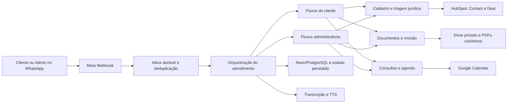
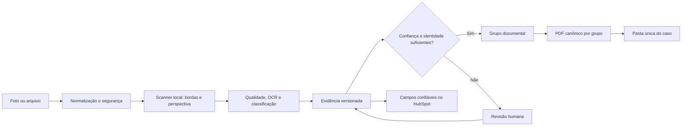

# Guia completo do Oráculum Bot

## 1. Finalidade

O Oráculum recebe pessoas pelo WhatsApp, identifica se existe um caso anterior, coleta o relato com linguagem acolhedora, organiza dados e documentos, registra o caso no HubSpot e no Drive, permite agendamento e oferece ferramentas administrativas para acompanhamento humano.

O bot não substitui o advogado e não deve prometer resultado jurídico. Sua função é organizar a entrada, preservar evidências, reduzir retrabalho e entregar ao escritório um caso compreensível e rastreável.

## 2. Filosofia operacional

Toda lógica deve obedecer a estes princípios, nesta ordem:

1. **Segurança e sigilo:** não expor documento, credencial, token ou dado pessoal em logs, links públicos ou respostas indevidas.
2. **Mesma pessoa, mesmo caso:** reutilizar Contact, Deal, número do caso e pasta existentes quando a identidade foi confirmada.
3. **Não inventar certeza:** OCR, IA e classificadores sugerem; evidência fraca, conflitante ou de terceiro exige revisão.
4. **Uma pergunta por vez:** pedir somente o próximo dado necessário e preservar o que já foi confirmado.
5. **Texto e áudio convergem:** a modalidade de entrada não cria regra jurídica paralela.
6. **Falhar com segurança:** uma integração indisponível não autoriza falso sucesso, duplicação ou perda silenciosa.
7. **Humano no controle:** ações sensíveis do Admin exigem caso selecionado e confirmação explícita.
8. **Automação com escopo:** agendador e pós-atendimento usam feature flag, allowlist, idempotência e histórico.

## 3. Visão do sistema

## 4. Entrada pelo WhatsApp

O `POST /webhook` valida a assinatura da Meta. Cada mensagem é normalizada, recebe uma chave durável e é gravada antes do HTTP 200. O dreno da inbox processa uma mensagem por vez, persiste o estado e marca o recebimento como concluído. Em reinício, registros pendentes são retomados.

O transporte de saída registra o identificador da Meta e acompanha estados `sent`, `delivered`, `read` e `failed`. A janela de 24 horas é calculada somente a partir de mensagem real do cliente; fora dela, o sistema usa template aprovado.

Funções centrais: `validarAssinaturaMeta`, `registrarMensagensWebhook`, `drenarWebhookInbox`, `processarMensagemWebhook`, `processarComLock` e `enviar`.

## 5. Identidade e continuidade do caso

A identidade operacional é conjunta:

- telefone canônico e Contact do HubSpot identificam a pessoa;
- Deal e `numeroCaso` identificam o assunto jurídico;
- a pasta do Drive e o estado documental pertencem ao mesmo caso;
- a retomada deve restaurar esse conjunto, nunca criar automaticamente outro caso.

Quando existem múltiplos casos, o cliente seleciona um caso permitido entre os seus próprios negócios. Ambiguidade não é resolvida por aproximação. O título segue a nomenclatura jurídica canônica e o número do caso.

Módulos principais: `identity.js`, `crm-identity/*`, `canonical-case*`, `case-number*`, `legal-case-nomenclature.js` e `client-menu-ui.js`.

## 6. Menu e atendimento do cliente

O menu inicial apresenta três caminhos acoplados à mensagem de entrada:

- status do caso;
- enviar documentos;
- falar com advogado.

Antes do menu, o bot decide entre retorno, novo atendimento, atendimento para terceiro e continuidade de uma etapa existente. Telas declarativas mantêm texto, opções, áudio e navegação coerentes. Uma entrada livre não reconhecida volta a um ponto seguro, sem apagar o progresso.

Módulos principais: `client-mode-ui.js`, `client-menu-ui.js`, `client-navigation-router.js`, `declarative-screen.js`, `declarative-screen-guard.js`, `pre-atendimento-*` e `client/handlers/*`.

## 7. Cadastro e correções

Nome, telefone, cidade, endereço e demais dados são coletados e confirmados de forma incremental. Correção por texto ou áudio atualiza somente o campo identificado. Os demais valores permanecem intactos. Credenciais do Meu INSS nunca são aceitas como campo comum nem armazenadas em notas abertas.

No WhatsApp Admin, a opção **Credenciais** apresenta o CPF confirmado e o link individual do registro seguro. O mesmo link é mantido em uma nota operacional idempotente do Negócio no HubSpot. O cofre interno usa o Neon, criptografia AES-256-GCM e a senha administrativa já configurada como senha mestre. Dados pessoais são atualizados automaticamente; somente a senha Gov.br/Meu INSS é informada ou alterada manualmente. A senha nunca aparece em notas, propriedades comuns do HubSpot, Drive, WhatsApp ou logs.

Cada Negócio possui um registro isolado. Abrir o link exige a senha mestre, cria uma sessão segura de dez minutos e permite visualizar/copiar ou atualizar a senha. O link sozinho não revela dados. A rotação da senha administrativa requer recriptografia planejada dos registros existentes; não se deve trocar essa variável diretamente em produção.

O HubSpot recebe propriedades permitidas pelo contrato. Divergência entre valor manual e extração automática não autoriza sobrescrita silenciosa.

Módulos principais: `name-normalization.js`, `phone-name.js`, `address-facts.js`, `geo-search.js`, `hubspot-contract.js`, `hubspot-sync.js` e handlers de revalidação.

## 8. Triagem jurídica

O relato é acumulado sem perder a fala original. Classificadores determinísticos e IA auxiliam na área, situação, urgência, perguntas seguintes e resumo. INSS e BPC possuem estados jurídicos mais detalhados. Outras áreas usam o catálogo comum e devem ser ampliadas sem criar uma segunda fonte de verdade.

Uma resposta de IA nunca deve inventar fato, prazo, documento recebido ou conclusão jurídica. Baixa confiança produz esclarecimento ou revisão humana.

Módulos principais: `legal-assistant-engine.js`, `legal-copilot.js`, `legal-dossier.js`, `inss-legal-facts.js`, `bpc-legal-facts.js`, `admin-assisted-intake-catalog.js` e `audio-legal-ai.js`.

## 9. Áudio recebido e voz das atendentes

Áudio recebido é baixado da Meta, validado, transcrito e encaminhado ao mesmo resolvedor usado pelo texto. Falha de transcrição pede reenvio ou texto; não muda o caso.

Na saída, `tts.js` normaliza pronúncias sem alterar a mensagem escrita, chama o Lightning/Supertonic e converte WAV para OGG/Opus. O JSON de `POST /tts` contém somente `text`; a identidade vocal segue no header `X-Oraculum-Voice`. O fallback preserva a resposta textual.

Mapeamento:

| Atendente | Voz |
| --- | --- |
| Helena | F4 |
| Clara | F1 |
| Beatriz | F2 |
| Isabela | F3 |
| Mariana | F5 |

A F4 continua sendo a voz padrão. O servidor Lightning multivozes validado fica versionado em `deploy/lightning/tts_api.py`; em 12 de agosto de 2026, F1–F5 foram carregadas com sucesso no Studio.

## 10. Documentos

O fluxo documental separa recebimento físico, análise e decisão:

Regras essenciais:

- o original permanece preservado e privado;
- a versão scanner é derivada localmente com OpenCV/WASM e só substitui a imagem do PDF quando as quatro bordas têm confiança suficiente;
- falha ou baixa confiança no recorte preserva a imagem orientada como fallback e nunca bloqueia o atendimento;
- a IA documental recebe apenas sinais técnicos e nomes de campos, sem fotografia, texto OCR bruto ou valores pessoais, e só pode recomendar revisão ou novo envio — nunca promover dado inseguro;
- RG frente e verso não são considerados completos apenas pela quantidade de imagens;
- a mesma imagem não pode valer como duas faces sem evidência visual;
- CPF, nome e nascimento só são promovidos quando documento, titularidade, confiança e ausência de divergência permitem;
- versões incertas ou conflitantes entram em revisão;
- documentos são consolidados por grupo: pessoais, residência e carteira de trabalho, mantendo ocorrências distintas quando necessário;
- **Outros documentos** é um fluxo complementar e nunca altera a lista obrigatória: o cliente escolhe entre comprovante do CRAS/Cadastro Único, prova adicional ou outro documento, envia um arquivo por vez, confirma o anexo e pode repetir;
- comprovantes do CRAS têm reconhecimento próprio, podem extrair nome, CPF, NIS, data de atualização e município quando a evidência for confiável e são consolidados em `05_Comprovantes_Cadastro_Unico_CRAS.pdf`;
- todo arquivo complementar preserva o original em `00 - Originais recebidos`, atualiza a análise do Negócio no HubSpot e mantém o caso em **Aguardando documentos** enquanto houver item obrigatório faltante;
- a pasta é única por caso, identificada também por `appProperties.oraculumCaseNumber`;
- nenhum upload cria permissão pública `anyone/reader`.

Módulos principais: `document-input-normalizer.js`, `document-scanner.js`, `document-ai-assistant.js`, `document-image-*`, `document-ocr.js`, `document-classifier.js`, `document-evidence-model.js`, `document-registry.js`, `document-requirement-engine.js`, `document-grouper.js`, `document-pdf-composer.js`, `supplemental-documents.js`, `document-human-review.js`, `document-hubspot-sync.js`, `document-state-repository.js` e `drive-files.js`.

## 11. WhatsApp Admin

O Admin possui autenticação, expiração de sessão e escopo pelo número autorizado. O menu organiza prioridades, casos, consulta, agenda, alertas, resumo e novo atendimento assistido.

Ao abrir um caso, o bot carrega Contact e Deal associados. Documentos, comunicação e agenda ficam em submenus. Pedir documentos e enviar lembrete exigem confirmação. Upload administrativo só é aceito durante a ação explícita de anexar documento. Paginação respeita o limite de opções do WhatsApp.

Módulos principais: `admin-auth.js`, `admin-case-*`, `admin-summary-ui.js`, `admin-assisted-*`, `admin-post-human-complementation.js` e a seção Admin do `server.js`.

## 12. Atendimento assistido

O advogado ou administrador pode registrar um atendimento já realizado. Texto, áudio e mídia são organizados numa sessão própria. O sistema apresenta revisão antes de criar ou atualizar o caso. Falha após efeito externo aciona rollback ou bloqueio seguro; não exibe falso sucesso.

O fluxo deve manter o mesmo Contact e Deal quando já existem e reutilizar as mesmas regras canônicas de cadastro, área, nomenclatura e documentos.

## 13. Pós-atendimento humano

A complementação pós-humana usa feature flag e allowlist. Um token opaco vincula Admin, Contact, Deal e caso. O ciclo durável pergunta uma pendência por vez, reavalia documentos no mesmo `cycleId` e bloqueia outbound duplicado quando o transporte já foi iniciado ou ficou incerto.

O reengajamento automático permanece uma decisão separada. Ativar complementação não autoriza mensagens indiscriminadas.

Módulos principais: `post-human-action-context-repository.js`, `post-human-cycle-model.js`, `post-human-dispatcher.js`, `post-human-flow.js`, `post-human-document-*` e `post-human-adaptive-sender.js`.

## 14. Agenda e automação interna

O Google Calendar é a fonte dos compromissos. O Oráculum mantém planos e jobs duráveis no Neon/PostgreSQL, com tentativa, idempotência, histórico e reconciliação. Alteração direta no Calendar é refletida na leitura/reconciliação seguinte.

O endpoint `POST /internal/processar-agendamentos` executa o lote. O GitHub Actions ou Google Apps Script pode apenas acordar o serviço; a lógica pertence ao Oráculum. O Make.com é legado/fallback e não é fonte de verdade.

O agendador só opera quando `INTERNAL_SCHEDULER_ENABLED=true` e o escopo foi explicitado por allowlist ou autorização consciente para todos.

Módulos principais: `calendar-scheduling.js`, `consultation-*`, `internal-scheduler.js`, `internal-scheduler-plans.js`, `internal-scheduler-postgres.js` e `.github/workflows/internal-scheduler-wakeup.yml`.

## 15. Persistência e recuperação

Arquivos operacionais são gravados atomicamente em `ORACULUM_DATA_DIR` e espelhados no Neon quando `EXTERNAL_STATE_PROVIDER=neon`. Em produção, falha da persistência externa bloqueia a inicialização. Inbox, deduplicação, callbacks e ciclos possuem recuperação própria.

Estado transitório que não pode sobreviver ao reinício deve sempre resultar em retomada segura ou solicitação de reenvio, nunca em avanço presumido.

Módulos principais: `state-persistence.js`, `external-state-repository.js`, `callback-idempotency.js`, `graceful-shutdown.js` e repositórios PostgreSQL.

## 16. Segurança e privacidade

- assinatura Meta obrigatória no webhook;
- segredo obrigatório nas rotas internas;
- callbacks opacos e case-sensitive;
- logs estruturados sanitizados;
- URLs públicas de áudio assinadas e com expiração;
- mídia validada por tipo, tamanho e assinatura;
- arquivos do Drive privados;
- páginas públicas de privacidade e exclusão de dados;
- nenhuma senha ou token em documentação, teste ou log.

## 17. Rotas HTTP

| Rota | Acesso | Responsabilidade |
| --- | --- | --- |
| `GET /health` | Público | Vida do processo e persistência externa obrigatória |
| `GET /health-interno` | Segredo interno | Diagnóstico operacional e configuração sem valores sensíveis |
| `GET /webhook` | Token Meta | Verificação inicial do webhook |
| `POST /webhook` | Assinatura Meta | Recebimento durável de mensagens e estados |
| `POST /internal/processar-agendamentos` | Segredo interno | Processamento do agendador |
| `POST /internal/processar-agendamentos-github` | OIDC GitHub | Despertar seguro do agendador |
| `GET /internal/agendador-status` | Segredo interno | Estado da fila e execução |
| rotas de consulta/reengajamento | Segredo interno | Compatibilidade e callbacks operacionais |
| páginas LGPD | Público | Política de privacidade e exclusão |

## 18. Organização do código

| Local | Papel |
| --- | --- |
| `server.js` | composição legado, rotas e orquestração central |
| `src/domain` | regras puras e fluxos de domínio |
| `src/adapters` | tradução para HubSpot, Drive e outros provedores |
| `src/infrastructure` | PostgreSQL, persistência e coordenação |
| `src/composition` | montagem explícita de dependências |
| `src/config` | configuração institucional e prontidão |
| `scripts` | migração, auditoria e operações controladas |
| `test` | contratos, regressões e gates de release |
| `docs` | fonte humana de arquitetura e operação |

O catálogo completo de funções fica em [reference/FUNCTION_CATALOG.md](reference/FUNCTION_CATALOG.md) e pode ser regenerado com `npm run docs:catalog`.

## 19. Como alterar o bot corretamente

1. Identifique a fonte canônica do domínio.
2. Evite acrescentar regra nova diretamente ao `server.js` quando ela cabe num módulo puro.
3. Preserve compatibilidade de estado e identidade.
4. Escreva teste para a decisão e teste estático apenas para wiring inevitável.
5. Não use serviço real em teste local comum.
6. Regenere o catálogo se funções mudarem.
7. Execute os gates do runbook.
8. Publique somente commit reproduzível e faça rollback se a saúde degradar.

## 20. Limites conhecidos

- `server.js` ainda é grande e deve ser reduzido gradualmente, sem reescrita total.
- a leitura de verso de RG difícil depende de evidência real e pode exigir revisão humana;
- INSS/BPC permanecem mais especializados, mas Trabalhista, Família, Consumidor, Bancário, Penal, Civil, Imobiliário e Outros já possuem triagem estruturada mínima coberta por teste;
- a configuração F1–F5 está validada; a disponibilidade contínua ainda depende de manter o processo do Lightning ativo ou supervisionado;
- testes reais de Meta, HubSpot, Drive e Calendar exigem canário controlado e autorização explícita.
